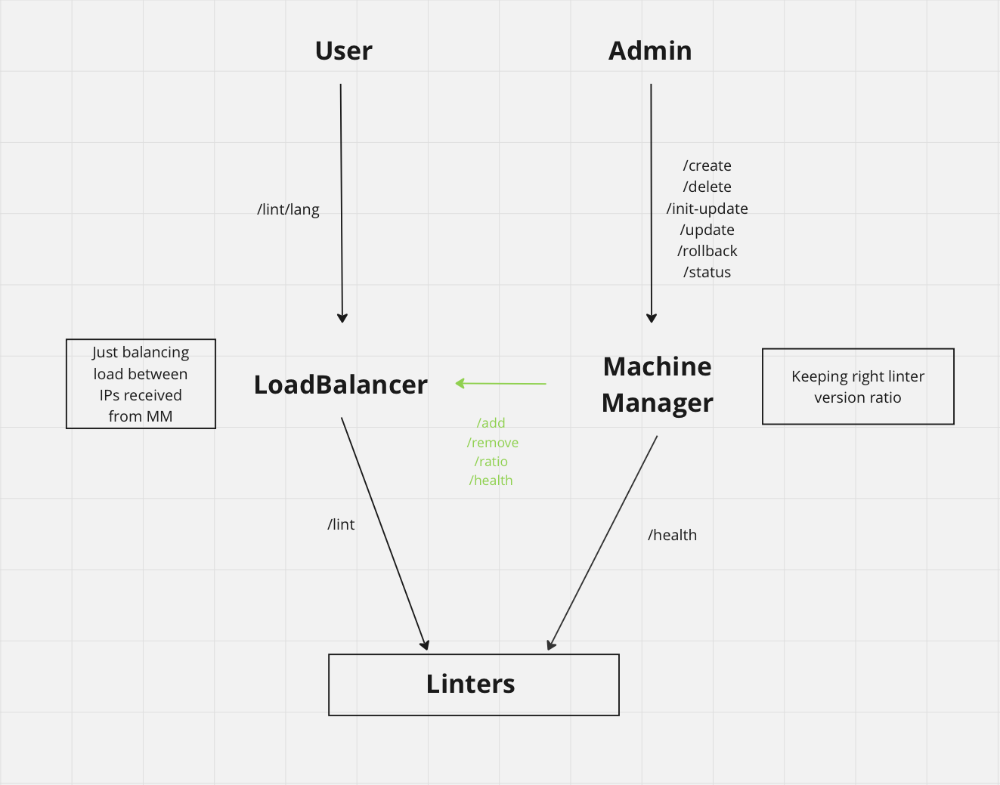

# Distributed Linters

## Summary

This is my fork of a group project for Engineering Distributed Infrastructure course in the winter semester 2023 at the University of Warsaw.

The project's goal was to design, implement and test a system for distributed deployment and management of REST API application servers.

The project was done under the guidance of Google's engineer from Warsaw office. Our group received 55/60 points for this assignment. 

You can see the original repo [here](https://github.com/mpiekutowski/mimuw-irio-distributed-linters).

## Project description
- A Linter is a simple REST API that allows the users to upload a piece of code and get feedback on it's style. The code can either pass the styling checks implemented by the linter or fail them - this is the message returned to the user.
- Linters come in different versions - different programming languages have different linters, each version can behave differently. This is to show the concept where a new version can introduce new features but also new bugs.
- The project's goal is to implement a service that allows to manage the linting service in a scalable and reliable way.
- Our service implements the following features:
    - **Unified entrypoint with load balancing** - although there can be multiple Linters running on separate machines, the client has a single entrypoint to query the service.
    - **Automatic machine management** - administrators can dynamically add/remove machines serving the linting service using API calls.
    - **Linter update** - administrators can issue an update to a different version of linting service. The update is done in a gradual way - only a few clients are updated at the beginning, with only a portion of the traffic being routed to the new version. After new version is confirmed to work as expected, the administrators can either continue the update or rollback to the previous version, if something goes wrong.
    - **Health check** - the service periodically checks the health of each machine serving linter service and adjusts load-balancing and linter versions in case when some of the machines are down.
    - **Fault injection testing** - our implementation provides a thorough E2E test suite, including tests simulating unresponsive machines and networking errors, which could impact the reliability of our system. 

## Architecture overview

## Documentation

You can see more detailed documentation under these links:
- [Usage](docs/usage.md)
- [Design document](docs/design_doc.md)
- [Testing strategy](docs/testing_strategy.md)
- [E2E tests](e2e_tests/README.md)